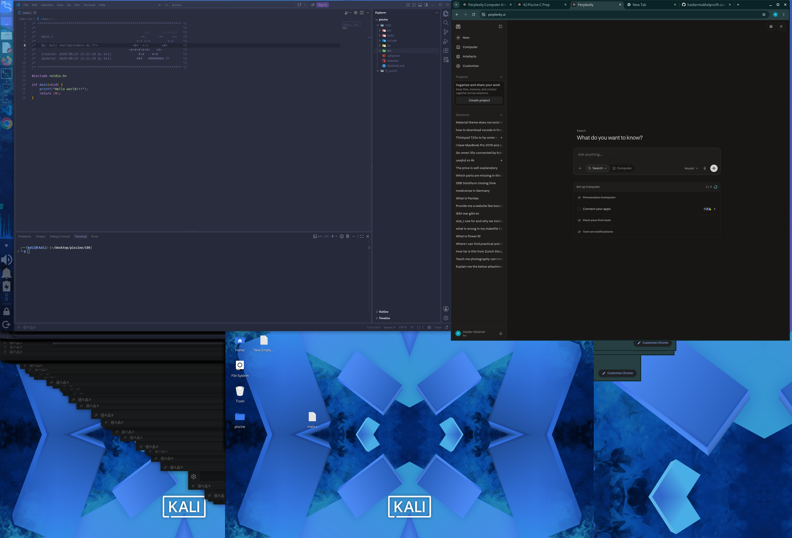

# FT Zurich Piscine

This repository contains my C programming exercises for Piscine C00.

## Requirements

- GCC compiler
- Linux or another Unix-like system

## Compile & Run

To compile a C file:

```bash
./mian
```

## Project Structure

```text
C00/
├── include
├─ src
|── main.c
├── lib
├── Makefile
└── README.md
```

## Exercise 00

This exercise prints one character.

Compile it with:

```bash
gcc -Wall -Wextra -Werror ex00/ft_putchar.c -o ft_putchar
```

## Screenshot



## Building the library

The static library file `libft_zurich.a` is not tracked by Git because compiled archives can differ between operating systems and toolchains. Build it locally on the operating system where you intend to use it.

### Build

From the repository root, build the library:

```sh
make -C ft_zurich
```

This generates:

```text
ft_zurich/lib/libft_zurich.a
```

### Copy for use in another project

After building, copy the library and the public header files into your project:

```sh
mkdir -p /path/to/your-project/lib /path/to/your-project/include
cp ft_zurich/lib/libft_zurich.a /path/to/your-project/lib/
cp ft_zurich/include/*.h /path/to/your-project/include/
```

Build the library separately on every target operating system. Do not copy a library archive built on one OS to another OS; instead, clone or copy the source code there and run the build command again.
